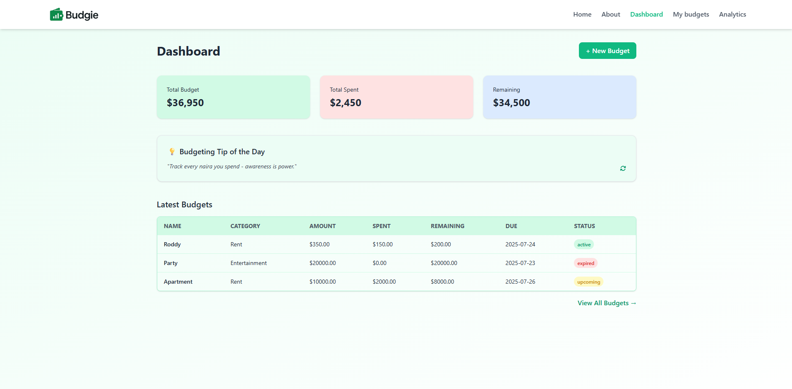
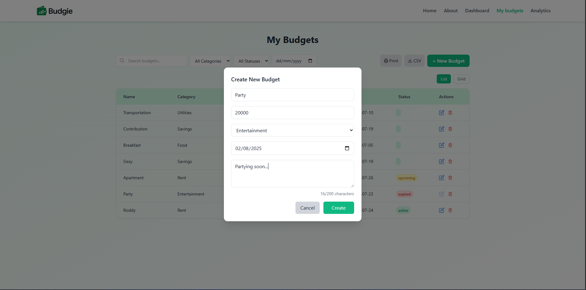
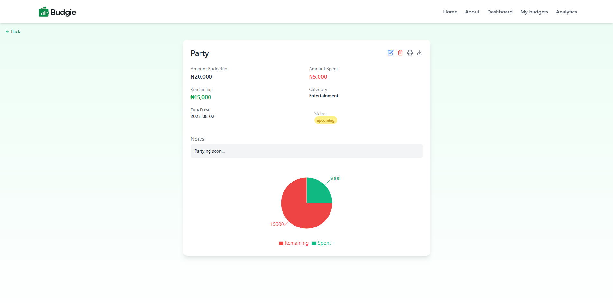
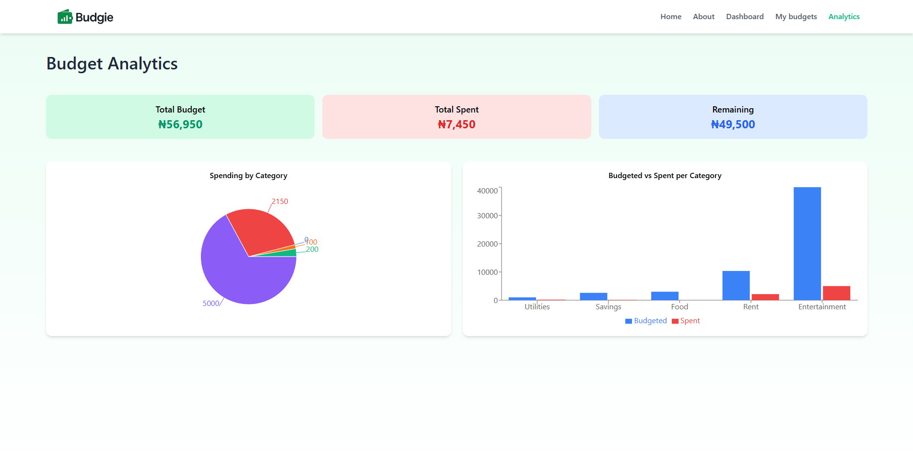

# 💰 Budgie - Simple Budgeting Dashboard

**Budgie** is a minimalist, intuitive budgeting dashboard built with React. It helps you **create, track, and manage** your budgets — so you can stay in control of your spending, savings, and goals.

Designed for simplicity and clarity, Budgie is perfect for individuals who want to stay on top of their finances without the complexity of traditional finance apps.

---

## ✨ Features

- ✅ Create and manage multiple budgets
- 📊 See total budget, spending, and remaining amount
- 🧠 Get budgeting tips and daily financial quotes
- 📈 View charts and analytics of budgets
- 📅 Track due dates and budget status (upcoming, expired, etc.)
- 💾 Budgets are stored locally (LocalStorage) for quick use
- ⚡ Rotational budgeting tips to ease budget stress

---

## 📸 Screenshots

> - 
> - 
> - 
> - 

---

## 🛠️ Tech Stack

- **React +Vite**
- **Tailwind CSS**
- **Framer Motion**
- **React Router**
- **React Toastify**

---

## 🚀 Getting Started

### 1. Clone the Repo

```bash
git clone https://github.com/Dev-Rodiyat/Budgie.git
cd Budgie
````

### 2. Install Dependencies

```bash
npm install
```

### 3. Start the App

```bash
npm start
```

The app runs at `http://localhost:5173`.

---

## 📁 Folder Structure

```
src/
├── components/       # Reusable UI components like Header, Layout e.t.c
├── pages/            # Main page views like Dashboard, Analytics e.t.c
├── assets/           # Icons, images, etc.
├── App.jsx           # Main routing and layout
└── index.js          # Entry point
```

---

## 🧠 Tip of the Day

Each day, users are greeted with a fresh budgeting tip or motivational quote — a small nudge to build better money habits 💡

---

## 📝 TODO / Future Improvements

* ✅ Budget status indicator (expired, upcoming, etc.)
* 🔜 Persistent storage with Firebase or Supabase or backend
* 🔜 User authentication and login
* 🔜 Connect crypto wallet (MetaMask, WalletConnect)
* 🔜 Store budgets or expense entries on-chain (Polygon or Base)
* 🔜 Reward users with $BUDGIE tokens for completing goals
* 🔜 Use NFTs to unlock premium themes or budget templates
* 🔜 View crypto balances inside the dashboard
* 🔜 Create shared DAO-style budgets with voting
* 🔜 Store budget data using decentralized storage (IPFS/Arweave)
---

## 🙌 Acknowledgements

Inspired by simple finance tools like [YNAB](https://www.youneedabudget.com/) and [EveryDollar](https://www.ramseysolutions.com/ramseyplus/everydollar).
